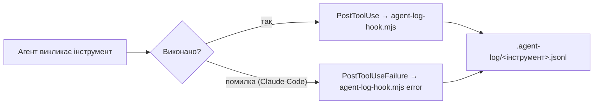
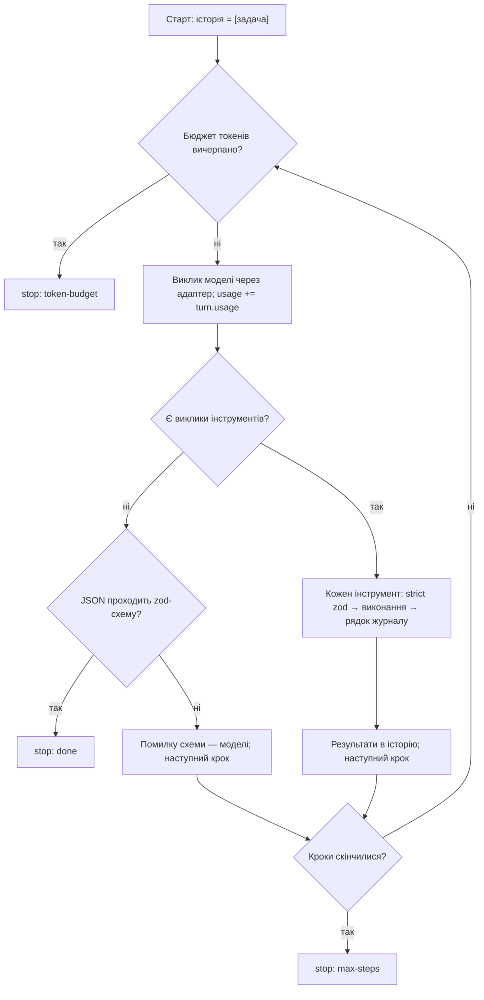
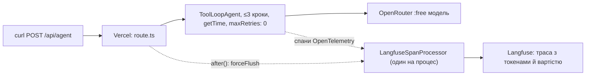

# Звіт · Лабораторна 1 — агентно-готовий репозиторій і власний агентний цикл

Автор: Сисак Віталій Романович, група 4cs-43
Репозиторій: https://github.com/VitaliySysak/AI-lab1 · деплой: `POST https://ai-lab1-sage.vercel.app/api/agent`
Період роботи: 2026-09-27 — 2026-09-28 · пара агентів кодування: **Claude Code** + **Antigravity CLI (agy)**

Цей файл — розповідь «що було → що зроблено → як воно працює → що з'ясувалося». Посилання на докази за кожним критерієм зібрано в [README.md](README.md); хронологія сесій — у [autonomy-log.md](autonomy-log.md).

---

## Коротко

- Репозиторій однаково працює у двох агентах: спільні правила ([AGENTS.md](../../AGENTS.md)), спільний журнал дій у форматі курсу, спільна навичка, заборона на `.env`, MCP Context7.
- Контроль над агентами доведено артефактами: 3 рядки `denied` від заборони, тест «видали 40%», 4 впевнені помилки з посиланнями на журнал, тест спрацювання навички 6/6 і 5/5, червоний CI до реалізації і зелений після.
- Написано власний агентний цикл із лімітом кроків і бюджетом токенів на двох формах API (Messages і Chat Completions), зупинки доведено тестами без мережі; той самий цикл перенесено на AI SDK 7 з підтвердженням деструктивного запису.
- Задеплоєно обробник на Vercel з трасуванням у Langfuse: траси з токенами й вартістю, вартість Gemini в Langfuse збіглася з прайсом `src/models.ts` до знака.
- Головні висновки: **схема перевіряє форму, а не правильність** (10 з 10 валідних JSON — і жодного розв'язку задачі); **читати файли чи вгадувати — властивість моделі, а межі — властивість обв'язки**; **безкоштовні хмарні рівні ненадійні для агентного циклу**.

---

## 1. Що було на старті

### Шаблон курсу (коміт `9ade0e7`, «Initial commit»)
Репозиторій створено через «Use this template» з `koldovsky/2026-2027-agentic-course-starter` (не форк — власна історія комітів).

| Що було | Стан |
|---|---|
| Next.js 16 (App Router), TypeScript strict, Vitest, Playwright | головна сторінка з підказкою «Ваше завдання: додати ендпоінт /api/health»; 57 тестів (`models`, `scripts`, `smoke`) |
| `AGENTS.md` | каркас на 47 рядків: 8 рядків службових коментарів і 9 маркерів `TODO` |
| `CLAUDE.md` | лише рядок імпорту `@AGENTS.md` і пояснення |
| `.claude/settings.example.json` | приклад hooks на `jq`: писав у журнал **увесь** `tool_input` (тобто й вміст файлів), заборона — лише на Write/Edit |
| `.claude/skills/`, `.agents/skills/`, `.agent-log/` | порожні (`.gitkeep`, README) |
| `scripts/` | `doctor.ts` (самоперевірка), `sync-skills.ts` (копія навичок), `transcript-to-jsonl.ts` (конвертер журналів) |
| `src/models.ts` | реєстр моделей за ролями (`cheap`, `balanced`, `frontier`, `local`, `embed`) з цінами і датами зняття |
| CI `.github/workflows/ci.yml` | job **verify** (типи, лінт, тести, збірка) і job **e2e** (Playwright, `continue-on-error`) |

### Середовище

| Компонент | Версія / стан |
|---|---|
| ОС | Windows 11, без WSL; Git Bash |
| Node.js / git | 24.18.1 / 2.55 |
| jq | 1.8.2 — встановлено на кроці 00 (для hooks шаблону) |
| Ollama | 0.34.4, модель `qwen3:4b`, RTX 4070 12 ГБ; контекст збільшено до 16384 на кроці 08 |
| Claude Code | 2.1.278 у сесіях лабораторної (оновився сам до 2.1.283) |
| Antigravity CLI | 1.2.8 → 1.2.12 (оновився сам між сесіями) |
| Акаунти | GitHub, Google AI Studio (ключ Gemini без білінгу), Vercel Hobby, Langfuse Cloud Hobby, OpenRouter (без поповнення, лише `:free`) |

---

## 2. Що в репозиторії тепер

```
AI-lab1/
├─ AGENTS.md, CLAUDE.md            правила для агентів (AGENTS.md — власноруч, 31 рядок)
├─ .gitattributes                  merge=union для журналів: злиття гілок не губить рядки
├─ .agent-log/                     журнал дій у форматі курсу (6 полів, JSONL)
│  ├─ claude-code.jsonl            415 рядків
│  ├─ antigravity.jsonl            68 рядків
│  └─ agent-loop.jsonl             44 рядки — власний цикл
├─ .claude/settings.json           hooks журналу і заборони + permissions.deny/allow
├─ .claude/skills/add-api-route/   навичка (джерело)
├─ .agents/skills/add-api-route/   копія для agy (npm run sync-skills)
├─ .agents/hooks.json              hooks журналу і заборони для agy
├─ scripts/
│  ├─ agent-log-hook.mjs           спільний hook журналу для обох агентів
│  ├─ guard-env.mjs                спільний pre-hook заборони .env, пише denied
│  ├─ measure-cost.ts              виміри кроку 07 (мережа)
│  └─ measure-loop.ts              прогони власного циклу (мережа)
├─ src/
│  ├─ health.ts                    zod-контракт /api/health
│  ├─ cost.ts                      облік токенів і вартості для різних форм API
│  ├─ otel/langfuse.ts             процесор спанів для Langfuse
│  └─ agent/
│     ├─ agent-loop.ts             власний агентний цикл
│     ├─ tools.ts                  list_files, read_file (лише читання, межі репозиторію)
│     ├─ adapters.ts               Messages-форма і Chat Completions-форма
│     └─ agent-aisdk.ts            той самий цикл на AI SDK 7 + write_file під підтвердженням
├─ app/api/health/route.ts         ендпоінт кроку 03
├─ app/api/agent/route.ts          задеплоєний агент з трасуванням
├─ instrumentation.ts, instrumentation.node.ts   OpenTelemetry + Langfuse
├─ tests/                          health, cost, agent-loop, agent-aisdk (без мережі) + health-link.spec.ts (Playwright)
└─ docs/lab1/                      пакет доказів і цей звіт
```

Гілки-докази: `lab1/agents-md-40-full`, `lab1/agents-md-40-cut` (тест 40%), `lab1/health-claude-code`, `lab1/health-antigravity` (крок 03), `lab1/health-loop` (власний цикл на тій самій задачі).

---

## 3. Як це працює

### 3.1 Правила для агентів
`AGENTS.md` читають обидва агенти: Antigravity — напряму, Claude Code — через рядок `@AGENTS.md` у `CLAUDE.md`. У файлі лише те, без чого агент помилиться саме тут: чотири перевірки перед «готово», заборона змінювати тести й контракти, межі (`.env`, `package-lock.json`, конфіги), підтвердження перед `git push` і залежностями, вибір моделі роллю, kebab-case у `src`. Кожен рядок перевірено питанням «що агент зробить неправильно без нього?», а тестом «видали 40%» — чи змінюється поведінка.

### 3.2 Журнал дій агента



Один скрипт `scripts/agent-log-hook.mjs` обслуговує обидва агенти: розуміє події Claude Code (`tool_name`, `tool_input`, `session_id`) і Antigravity (`toolCall.name`, `toolCall.args`, `conversationId`) і пише рядок у 6 полях курсу: `ts, tool, input, result, session, source`. У `input` потрапляють лише шлях, команда, шаблон чи запит — **ніколи вміст файлу**; тіло heredoc (`cat > file <<EOF … EOF`) вирізається, бо це теж вміст. Файли журналу злиттям гілок не губляться завдяки `merge=union` у `.gitattributes`.

### 3.3 Заборона на `.env`

| Шар | Що робить | Що пропускає |
|---|---|---|
| 1 · порада | рядок в `AGENTS.md` | модель тлумачить і може забути; Claude Code з явним дозволом людини пробує дію |
| 2 · правила дозволів | `permissions.deny: Read/Edit(.env, .env.local)` у `.claude/settings.json` | команди-підпроцеси (`node -e …`) |
| 3 · pre-hook | `scripts/guard-env.mjs` на `Bash\|PowerShell\|Write\|Edit\|MultiEdit\|Read\|Grep` — **сам пише** `denied` і блокує (код 2 / `{"decision":"deny"}`) | ім'я файлу, зібране зі шматків, base64, скрипт, що сам відкриває файл — hook бачить лише текст |
| 5 · CI | типи, лінт, тести, збірка після факту | — |

`PostToolUse` на заблокований виклик не спрацьовує, тому рядок `denied` пише саме pre-hook. `PowerShell` у matcher обов'язковий: на Windows Claude Code виконує команди саме ним. Значення після `=` маскуються (`TEST_KEY=***`), щоб спроба запису ключа не опублікувала його в журналі.

### 3.4 Навичка `add-api-route`
`SKILL.md` описує процедуру «контракт zod → червоний тест → обробник → `check-route.mjs` → чотири перевірки» і межі. Скрипт `check-route.mjs` перетворює «здається, зробив» на код виходу: 0 — обробник, схема й тест на місці, 1 — ні; окремо ловить імпорт значення через аліас `@/`, якого не знає Vitest. Джерело — `.claude/skills/` (читає Claude Code), копія — `.agents/skills/` (читає Antigravity) через `npm run sync-skills`.

### 3.5 Власний агентний цикл



- **Ядро** (`agent-loop.ts`, функція `runAgentLoop` — 42 рядки) не знає форми API: модель передається функцією.
- **Інструменти** (`tools.ts`) — лише читання, `resolveInside` не випускає за межі репозиторію і не дає читати `.env*` (результат `denied`); аргументи перевіряються `zod.strict()`, невалідний виклик не виконується, а помилка йде моделі.
- **Адаптери** (`adapters.ts`) перетворюють нейтральну історію на запит своєї форми: Messages (`tool_use` / `tool_result`, повний вхід = `input_tokens + cache_read_input_tokens`) і Chat Completions (`tool_calls` / `role: "tool"`, `arguments` — JSON-рядок). HTTP-помилки не ковтаються; відповідь шлюзу «200 без `choices`» дає зрозумілу помилку з текстом шлюзу.
- **Тести** (`agent-loop.test.ts`, 15) — підроблена модель і підроблений `fetch`, мережа в тестах = помилка. Мутаційна перевірка: без перевірки бюджету падає рівно тест бюджету; з «завжди валідним» виходом — 4 тести структурованого виходу.

### 3.6 Той самий цикл на AI SDK 7 і підтвердження запису

```mermaid
sequenceDiagram
  participant U as Людина
  participant R as runWithApproval
  participant A as ToolLoopAgent
  R->>A: generate(історія)
  A-->>R: tool-approval-request (write_file)
  R->>U: Дозволити write_file …? (y/n)
  U-->>R: y або n
  R->>A: generate(історія + відповідь моделі + рішення людини)
  A-->>R: при «так» — write_file виконано; при «ні» — модель отримує відмову
```

`toolApproval: { write_file: 'user-approval' }` — драбина довіри, записана кодом: без «так» людини деструктивний інструмент не виконується. Тест перевіряє обидва випадки (`approved: false` → 0 записів, `true` → 1); без рядка `toolApproval` обидва червоніють.

### 3.7 Деплой і траси



`instrumentation.ts` запускає OpenTelemetry один раз на старті сервера; `src/otel/langfuse.ts` тримає один процесор на `globalThis` (Next.js бандлить instrumentation і маршрут окремо); `after()` дочікується відправлення спанів навіть при помилці обробника. Ключі — лише в `.env.local` і змінних Vercel.

### 3.8 CI
Кожен push запускає job **verify** (typecheck → lint → test → build) і, після нього, **e2e** (Playwright зі скріншотом в артефакті). Самоперевірка брам: навмисно зламаний тест у тимчасовій гілці зробив verify червоним на «Юніт-тести», e2e пропущено ([run 36409965999](https://github.com/VitaliySysak/AI-lab1/actions/runs/36409965999)).

---

## 4. Хід роботи за кроками

| Крок | Що зроблено | Результат і доказ |
|---|---|---|
| 00 · середовище | jq, Ollama + qwen3:4b, `.env.local`, git з noreply-поштою; перші сесії обох агентів у режимі плану | шаблон зелений (57 тестів, build); [autonomy-log.md](autonomy-log.md) сесії 1–2 |
| 01 · AGENTS.md | написано власноруч (каркас 47 рядків → 33; після тесту 40% — 30; зараз 31); тест «видали 40%» — 8 з 18 змістовних рядків | без рядка про 4 перевірки агент не запускав build → рядок повернуто; 3 рядки видалено; пізніше повернуто kebab-case ([agents-md-40.md](agents-md-40.md)) |
| 02 · журнал | спільний Node-hook для обох агентів замість jq-прикладу | записи обох інструментів у 6 полях; вміст файлів не пишеться |
| 03 · /api/health | контракт і червоний тест до коду (`768ecab`, червоний CI); по гілці на агента, план → реалізація | обидві реалізації 3/3 і `ƒ /api/health`; у main — Claude Code (`f816e2e`); план №1 Claude з аліасом `@/` відхилено ([confident-errors.md](confident-errors.md)) |
| 04 · навичка | `add-api-route` + `check-route.mjs`, синхронізація, 12 сесій тесту спрацювання | Claude Code 6/6, agy 5/5 дійсних; Н3 agy недійсний — агент прочитав таблицю тесту ([skill-trigger.md](skill-trigger.md)) |
| 05 · заборона і MCP | `guard-env.mjs` + `permissions.deny`; Context7 у скоупі user | 3 рядки `denied` (Bash, Bash, PowerShell); Context7 — +19.8k токенів на запит ([context-cost.md](context-cost.md)) |
| 06 · скріншот | посилання «Стан сервісу» (Claude Code за планом) і `health-link.spec.ts` | job e2e зелений у CI, скріншот з артефакту — [e2e-home.png](e2e-home.png) |
| 07 · вартість | `cost.ts` (нормалізація usage), `measure-cost.ts`, звірка цін з Google | оцінка 0.0% від факту; кеш Gemini 8 978 і Ollama 1 962 токени; ua/en 1.49 і 2.29 ([cost.md](cost.md)) |
| 08 · власний цикл | ядро, інструменти, два адаптери, 15 тестів; 2 серії по 10 прогонів; та сама задача в `lab1/health-loop` | серія 1 — 2/10, серія 2 — 10/10; пропозиції qwen3:4b не пройшли `health.test.ts` (0/3 і 1/3) ([comparison.md](comparison.md)) |
| 09 · AI SDK | `agent-aisdk.ts` на `ToolLoopAgent`, `write_file` під `toolApproval`, тест + мутація | 387 рядків власного циклу проти 109; SDK прибрав механіку, але й бюджет токенів |
| 10 · деплой | `/api/agent` на Vercel, OpenTelemetry + Langfuse; Gemini → OpenRouter `:free` | 6 успішних трас з деплою, 3 з вартістю $0.00; знімки в [traces/](traces/) |
| 11 · пакет | три прогони (шлюз і локально), [model-decision.md](model-decision.md), [intro-draft.md](intro-draft.md), [README.md](README.md), пошук ключів в історії, самоперевірка брам | ключів в історії немає; verify червоніє на зламаному тесті |

---

## 5. Ключові числа

| Що | Значення | Джерело |
|---|---|---|
| Тести | 92 у 7 файлах, усі зелені; CI verify зелений | `npm test`, Actions |
| Сесії в журналі автономності | 19 | [autonomy-log.md](autonomy-log.md) |
| Рядки журналу дій | 415 (Claude Code) · 68 (agy) · 44 (власний цикл) | `.agent-log/` |
| Рядки `denied` | 6: 3 — перевірка заборони в бою (сесії `970416f5`, `96d441ce`, `72aaabec`), 3 — хибні спрацювання на командах сесії-помічника (`5fac2946`, `1bbf2875`), у тексті яких було слово `.env` | `claude-code.jsonl` |
| Впевнені помилки | 4 з посиланнями на журнал + кандидати | [confident-errors.md](confident-errors.md) |
| Оцінка входу Gemini до виклику | 15 613 = факт, похибка 0.0% | [cost.md](cost.md) |
| Кеш | Gemini 8 978 з 15 613 (3-й виклик); Ollama 1 962 з 1 963, затримка 46 761 → 501 мс | [cost.md](cost.md) |
| Множник ua/en | 1.49 (gemini-3.8-flash), 2.29 (qwen3:4b) | [cost.md](cost.md) |
| Ціна MCP Context7 | 30.2k → 50.0k токенів контексту після одного запиту | [context-cost.md](context-cost.md) |
| Власний цикл, 10 прогонів | 2/10 → 10/10 валідних після `/no_think`, `maxTokens: 6144`, контексту 16384 | [comparison.md](comparison.md) |
| Та сама задача /api/health | Claude Code 3/3 · agy 3/3 · цикл на qwen3:4b 0/3 і 1/3 | [comparison.md](comparison.md) |
| Деплой до / після заміни моделі | Gemini: 188/218 токенів, $0.000958, 17.5 с, 1 з 3 трас без помилки · nemotron `:free`: 687/203, $0.00, 8.0 с, 6 з 7 | [model-decision.md](model-decision.md) |

---

## 6. Що з'ясувалося

1. **Валідний ≠ правильний.** Схема `Proposal` перевіряє лише форму; qwen3:4b видав 10 валідних JSON, не прочитавши `tests/health.test.ts` жодного разу, і пропонував переписати контракт і тест (з мережею). Правильність доводить лише тест, написаний до задачі.
2. **Модель проти обв'язки.** Той самий цикл з Gemini і з `nemotron-3.5-lightning` читав `src/health.ts`, тест і `AGENTS.md` перед відповіддю — читати чи вгадувати вирішує модель. Обв'язка відповідає за межі: жоден невдалий прогін не вийшов за 12 кроків, жоден невалідний вихід не став результатом, HTTP 429 зупиняв прогін без спалювання квоти.
3. **Впевнені помилки повторюються.** Обидві моделі в різних сесіях стверджували, що без `force-dynamic` маршрут був би статичним, — хоча build цього проєкту показав `ƒ`; Claude Code ще й написав «перевірив збиранням», запустивши лише варіант з рядком.
4. **Режим плану — не «лише читання».** Обидва агенти в режимі плану писали файл плану поза репозиторієм; agy виконував команди (`npm test`) і створив файл у репозиторії після «Виконуй план», не виходячи з `/plan`.
5. **Один прогін тесту 40% не доводить, що рядок — баласт.** Kebab-case агент вгадав у тесті, а на кроці 04 назвав файл `isoDate.ts`.
6. **Тестові матеріали видимі агентові.** agy прочитав таблицю тесту навички і журнали іншого інструмента й «вгадав» очікувану поведінку — результат визнано недійсним.
7. **Роздуми моделі коштують.** qwen3:4b витрачала весь `max_tokens` на міркування; у хмарних відповідях `reasoningTokens` часто більші за текст відповіді.
8. **Безкоштовна хмара ненадійна для циклу.** Gemini free tier — 5 запитів/хв і 20/добу, 503 у пікові години, а AI SDK повторював кожну невдачу двічі (тому `maxRetries: 0`); `:free`-моделі OpenRouter по черзі давали 429 спільного пулу.
9. **Українська дорожча, але для навички виправдана:** +~120 токенів на запит для AGENTS.md (~0.4% контексту) проти точного збігу опису навички з мовою запитів.

---

## 7. Відомі обмеження і відступи

- **Журнал agy:** `PostToolUse` не спрацьовує на невдалий виклик інструмента, а команда з ненульовим кодом виходу приходить як успіх — у рядках `run_command` agy `ok` не доводить успіху; спроба брати код з транскрипту наживо не працює (транскрипт пишеться після hook). Описано в [portability.md](portability.md).
- **Hook заборони agy** наживо не спрацював жодного разу: агент відмовлявся ще на шарі 1 (AGENTS.md); логіку перевірено на штучних подіях.
- **Заборона — текстова:** не ловить ім'я файлу, зібране зі шматків, base64, скрипт, що сам відкриває `.env`; і навпаки, блокує невинні команди зі згадкою `.env` у тексті. На Windows без WSL2 пісочниці немає.
- **Модель деплою задана рядком у змінній `OPENROUTER_MODEL`, а не роллю з `src/models.ts`** — відступ від власного AGENTS.md; причина і шлях повернення — у [model-decision.md](model-decision.md).
- **AI SDK-версія** не має бюджету токенів і журналу викликів; на qwen3:4b структурований вихід (`Output.object`) конфліктує з викликами інструментів.
- **Тест 40%:** видалення рядків закомічено разом із прогоном, а не окремим комітом (diff `AGENTS.md` у коміті все одно показує видалене).

---

## 8. Що ще не завершено

- Рядок «хмара» (Gemini) у розділі 4 [cost.md](cost.md) і в [comparison.md](comparison.md), ручний запуск SDK-агента на Gemini (`n`, потім `y`) — Gemini free tier повертав 503/429.
- Червоний прогін «поганого патча» — чекаю пул-реквест від викладача.
- Перед поданням: оновити посилання на останній зелений прогін у [README.md](README.md), посилання на репозиторій — у таблицю групи.

---

## 9. Як перевірити самому

```bash
npm install
npm run typecheck && npm run lint && npm test && npm run build
npm run sync-skills -- --check
node .claude/skills/add-api-route/scripts/check-route.mjs health
printf '{"prompt":"%s"}' 'Котра зараз година?' | curl -s -X POST https://ai-lab1-sage.vercel.app/api/agent -H 'Content-Type: application/json; charset=utf-8' --data-binary @-
```

Прогони з мережею й ключами (потрібен `.env.local`): `npx tsx --env-file=.env.local scripts/measure-cost.ts gemini|ollama|lang docs/lab1/cost.md`, `npx tsx --env-file=.env.local scripts/measure-loop.ts ollama-messages|ollama-chat|gemini|openrouter <N>`.

---

## 10. Використання ШІ

Лабораторну виконано разом із Claude Code як помічником — сесія `5fac2946`, після перезапуску застосунку 2026-09-28 — `1bbf2875` (інструкції, перевірки, інфраструктурний код, перенесення коду курсу, чернетки документів, зокрема цього звіту); AGENTS.md, контрольні сесії агентів, ключі, акаунти, деплой, запуск вимірів і рішення — мої. Детально — у розділі «Використання ШІ» [журналу автономності](autonomy-log.md).
